# Informe 
### 1. Titulo

 Crear y personalizar dos servidores web con Nginx usando Docker

### 2. Tiempo de duración

180 minutos

### 3. Fundamentos:
Contenedores Docker:
Un contenedor es una unidad estandarizada de software que empaqueta código y dependencias. Docker permite crear/ejecutar contenedores mediante aislamiento de recursos (CPU, RAM) usando características del kernel Linux como namespaces y cgroups.

    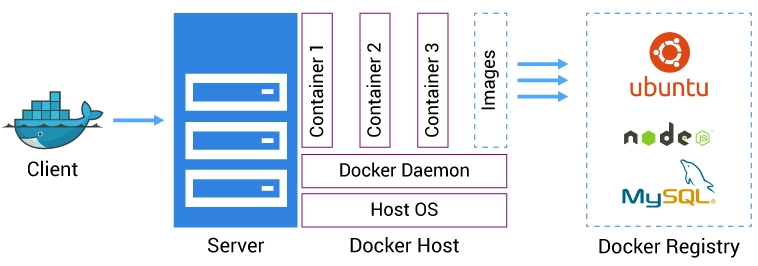

##### Servidor Web Nginx
Nginx es un servidor web de alto rendimiento que funciona como balanceador de carga y proxy inverso. Su arquitectura basada en eventos lo hace ideal para manejar miles de conexiones simultáneas.

##### Mapeo de Puertos

Al ejecutar -p 8089:80, Docker redirige el puerto 80 del contenedor al 8089 del host. Esto evita conflictos cuando múltiples contenedores usan el mismo puerto internamente.

### 4. Conocimientos previos.
   
Para realizar esta practica se debe tener conocimentos previos sobre los siguientes temas:
- Comandos básicos de Linux (docker cp, nano/vi)
- Navegación en navegadores web para pruebas (localhost:puerto)
- Fundamentos de HTML para editar index.html

### 5. Objetivos a alcanzar
   
- Implementar dos contenedores Nginx con puertos personalizados
- Manipular archivos HTML dentro de contenedores mediante docker cp
- Personalizar contenido web para contextos institucional y personal
  
### 6. Equipo necesario:
  
- Computador con sistema operativo Windows/Linux/Mac.
- Cuenta en Docker Play (opcional para pruebas en la nube)
- Conexión a internet para acceder a documentación y recursos.

### 7. Material de apoyo.
   
- Documentación Oficial de Docker
- Guía de comandos de Linux-Docker.
- Nginx: Configuración Básica
  
### 8. Procedimiento

Paso 1:  Crear el primer contenedor Nginx llamado nginx1 exponiendo el puerto 8089 para ello se ocupo los siguientes comandos "docker run --name nginx1 -d -p 8089:80 nginx".

    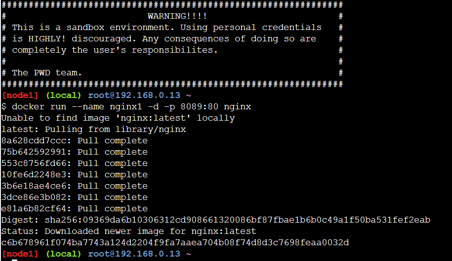

Figura 1-. Creación del primer contenedor llamado nginx1.

 Paso 2:  Crear un segundo contenedor Nginx llamado nginx2 exponiendo el puerto 8090 para ello se ocupo los siguientes comandos "docker run --name nginx2 -d -p 8090:80 nginx".

    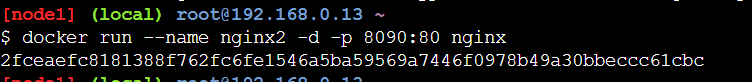

Figura 1-2. Creación del segundo contenedor llamado nginx2.

 Paso 3: Se verifica que esten creados los dos contenedores correctamente.

    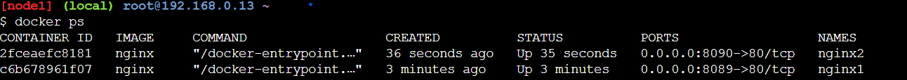

Figura 1-3. Muestra la creación de los dos contenedores el nginx1 y nginx2.

 Paso 4: Copiar el archivo index.html desde el contenedor nginx1 al sistema anfitrión para ello se ocupo los comandos "docker cp nginx1:/usr/share/nginx/html/index.html ./index1.html"

    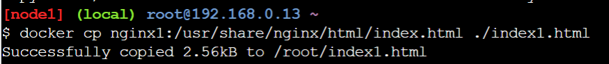

Figura 1-4. Muestra el copiado del archivo index1.html.

 Paso 5: Editar el archivo index1.html con un editor como nano o vi, incluyendo información del instituto.

    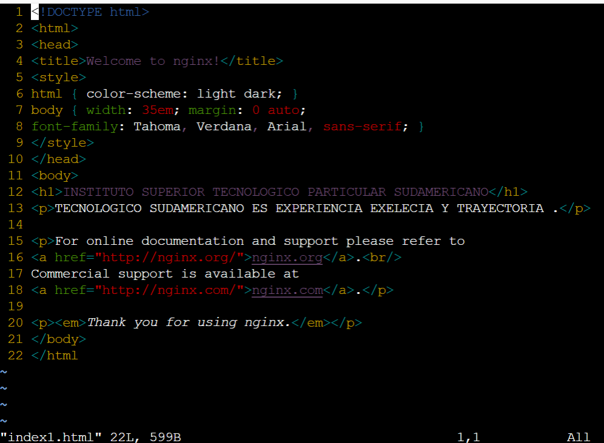

Figura 1-5. Muestra la estructura del index.html modificado.

 
 Paso 6: Copiar el archivo editado nuevamente al contenedor nginx1: docker cp ./index1.html nginx1:/usr/share/nginx/html/index.html

    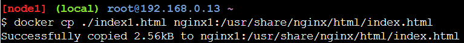

Figura 1-6. Se copia el archivo editado a su contenedor nginx1.

 

    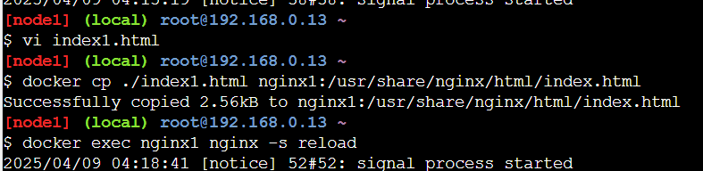

Figura 1-6-1.Muestra los comandos "vi" para entrar el html. y "docker exec nginx1 nginx -s reload" para recargar Nginx sin reiniciar el contenedor.Para poder visualizar los cambios realizados.

 Paso 7: Visualizacion de la pagina  con los cambios realizados con información de la institución.

    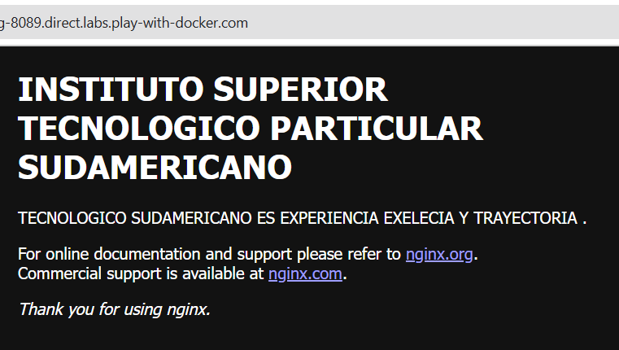

Figura 1-7. Muestra la pagina con los cambios.

#### Se repite el proceso para nginx2:
Paso 8: Copiar el archivo index.html desde el contenedor nginx2 al sistema anfitrión para ello se ocupo los comandos "docker cp nginx2:/usr/share/nginx/html/index.html ./index2.html"

    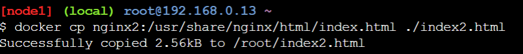

 
Figura 1-8. Muestra el copiado del archivo index2.html.

 Paso 9: Editar el archivo index2.html con un editor como nano o vi, incluyendo información  personal del estudiante.

    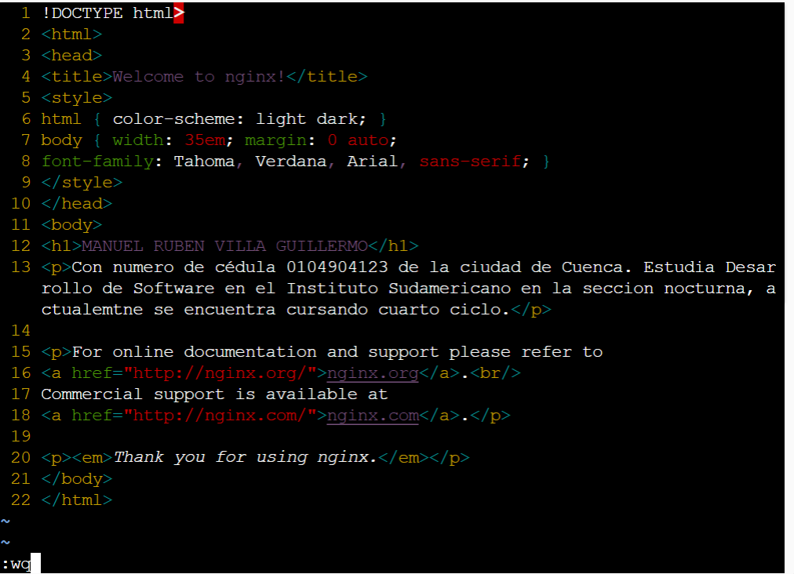

Figura 1-9. Muestra la estructura del index2.html modificado.

 Paso 10: Copiar el archivo editado nuevamente al contenedor nginx2: docker cp ./index2.html nginx2:/usr/share/nginx/html/index.html

    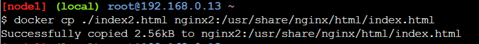

Figura 1-10. Se copia el archivo editado a su contenedor nginx2.

 

    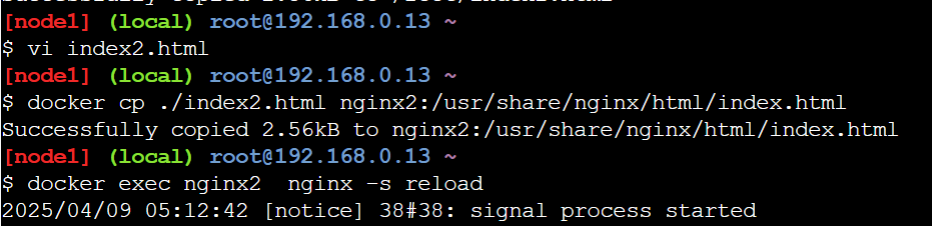

Figura 1-10-1.Muestra los comandos "vi" para entrar el html. y "docker exec nginx2 nginx -s reload" para recargar Nginx sin reiniciar el contenedor.Para visualizar los cambios realizados.

 Paso 11: Visualizacion de la pagina  con los cambios realizados con datos personales.

    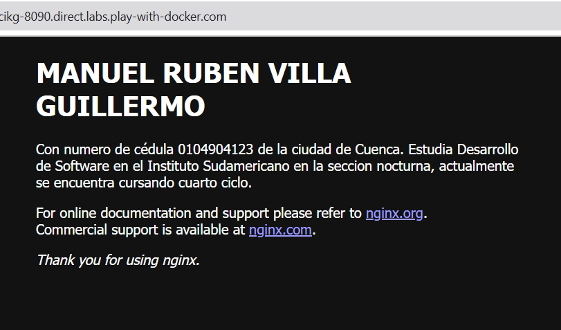

Figura 1-7. Muestra la pagina con los cambios.

### 9. Resultados esperados:
    
Adquirir confianza en la creación y administración de contenedores Docker, lo que permite trabajar con servidores de forma más eficiente y ordenada.Comprender el funcionamiento básico de Nginx como servidor web y cómo personalizar su contenido desde los archivos HTML.

Obtener conocimientos fundamentales sobre el mapeo de puertos entre el host y los contenedores.Desarrollar la capacidad de modificar y actualizar el contenido de servidores sin necesidad de detener los servicios, usando herramientas de edición y recarga como vi y nginx -s reload.
### 10. Bibliografía

- Hamilton, J. (2007). On designing and deploying internet-scale services. In Proceedings of the 21st Large Installation System Administration Conference 2 (pp. 1-14). USENIX Association. Lowery, R. (2016). Docker in Action. Manning Publications.

- maguaman2. (2024). Semana 2 - Docker [Repositorio GitHub]. GitHub. https://github.com/maguaman2/tendencias-tecnologicas/blob/main/gist-semana2-docker.md

- Turnbull, J. (2017). The Docker Book: Containerization is the new virtualization. Lulu. com.

- Play with Docker Labs. (s. f.). Interactive Docker playground. https://labs.play-with-docker.com/